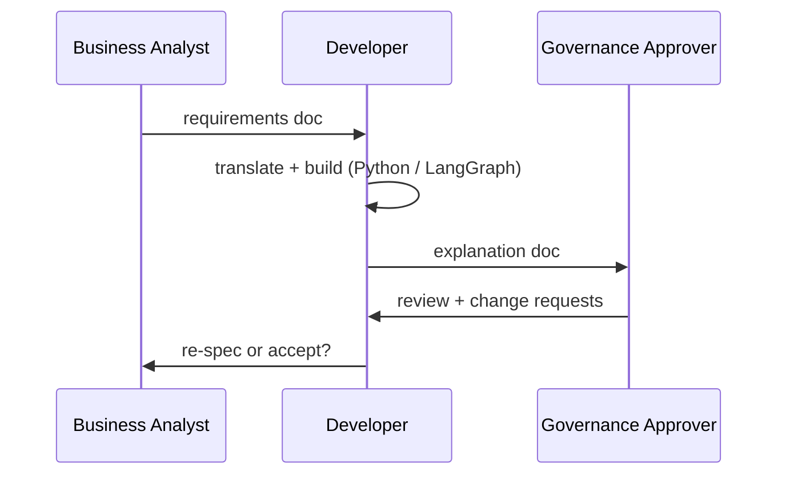
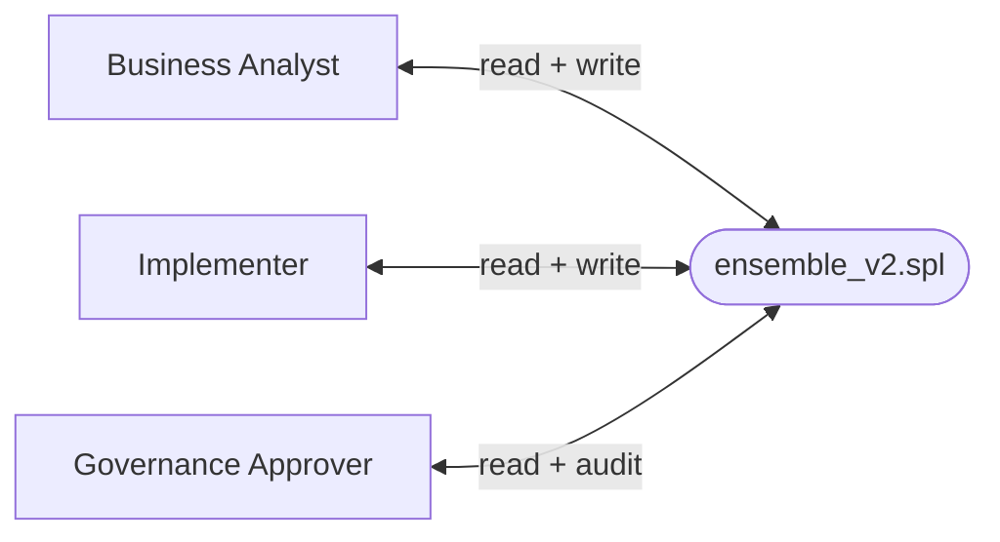

# SPL vs LangGraph: The Case for Readability by Design

> **Note:** SPL is a new language, tested in the recipes in this book and
> validated against a range of real workflows. The observations below are
> based on that hands-on experience and a survey of available frameworks.
> They are offered as reasoned arguments, not proven conclusions — the wider
> community has yet to weigh in.

---

## The Translation Cost

Every AI application built with a framework like LangGraph, AutoGen, or CrewAI
tends to go through the same cycle: **translation**.

A business analyst writes a requirements document describing what the workflow
should do. A developer reads it, translates it into Python — wiring up nodes,
defining state schemas, configuring edges, handling boilerplate. A governance or
compliance approver then needs to verify that what was built matches what was
specified, but they cannot read Python, so someone translates it back into plain
English for them.

Three roles. Three languages. Three translation steps. Each one is a chance to
introduce misunderstanding, drift, or an audit gap.

SPL is designed to reduce this cost by making the workflow itself readable across
all three roles. The recipe is meant to serve simultaneously as specification,
implementation, and audit trail — though how well this holds in large-scale
production environments remains to be seen.

---

## Readability by Design

SPL is not a framework bolted onto a programming language. It is a domain language
designed so that different roles can read the same file and each find what they need:

| Role | What they read in SPL |
|---|---|
| **Business Analyst** | `WORKFLOW`, `INPUT`, `OUTPUT`, `GENERATE`, prompt text inside `CREATE FUNCTION` — the *what* |
| **Implementer** | `CALL`, `USING MODEL`, `WHILE`, `EXCEPTION WHEN` — the *how*; Python tools for deterministic computation |
| **Governance Approver** | `INPUT`/`OUTPUT` contract, `EXCEPTION` handlers, `COMMIT WITH status=` — the audit trail |

The major Python-based frameworks — LangGraph, AutoGen, CrewAI — were not designed
with this goal. Their workflows are Python programs. A business analyst cannot
meaningfully read a `StateGraph`, a `TypedDict`, or a conditional edge routing
function. A governance approver working through those constructs needs a developer
as interpreter, which makes the developer a bottleneck in the review process.

The SQL analogy is instructive here, though not a guarantee. A database
administrator, a data analyst, and an auditor can all read
`SELECT customer_id FROM orders WHERE total > 1000`. SQL became a shared language
across roles precisely because it was designed to be readable, not just executable.
Whether SPL can achieve a similar outcome in the AI workflow space is an open
question — but the design intent is the same.

---

## The Ensemble Voting Example

The ensemble voting recipe — generating multiple candidate answers from different
models, scoring each with an independent model, finding consensus, and polishing the
winner — is a non-trivial AI workflow. It involves looping, random model selection,
deterministic computation, and multi-step output management.

The same workflow was implemented in both SPL and LangGraph. Read them side by side:

### SPL — `ensemble_v2.spl`

```spl
WORKFLOW ensemble_voting_v2
    INPUT:
        @question          TEXT,
        @models            LIST    DEFAULT ['llama3.2', 'qwen2.5', 'gemma3', 'mistral', 'deepseek-r1'],
        @n_candidates      INT     DEFAULT 5,
        @random_selection  BOOL    DEFAULT TRUE,
        @consensus_model   TEXT    DEFAULT 'qwen2.5',
        @polish_model      TEXT    DEFAULT 'deepseek-r1',
        @log_dir           TEXT    DEFAULT 'cookbook/20_ensemble_voting/logs'
    OUTPUT: @final_answer TEXT
DO
    -- Step 1: Generate N candidates, each from a randomly picked model
    WHILE @i < @n_candidates DO
        CALL pick_model(@models, '', @random_selection, @i) INTO @gen_model
        GENERATE answer_candidate(@question) USING MODEL @gen_model INTO @candidate
        CALL clean_output(@candidate) INTO @candidate

        CALL pick_model(@models, @gen_model, @random_selection, @i) INTO @score_model
        GENERATE score_candidate(@candidate, @question) USING MODEL @score_model INTO @score
        CALL clean_output(@score) INTO @score
        ...
    END

    -- Step 2: Find consensus, select winner, polish
    GENERATE find_consensus(@candidates_text) USING MODEL @consensus_model INTO @consensus
    CALL select_winner(@candidates_joined, @scores_joined) INTO @best_candidate
    GENERATE polish(@best_candidate, @consensus, @question) USING MODEL @polish_model INTO @final_answer

    COMMIT @final_answer WITH status = 'complete', candidates = @n_candidates

EXCEPTION
    WHEN BudgetExceeded THEN
        CALL select_winner(@candidates_joined, @scores_joined) INTO @final_answer
        COMMIT @final_answer WITH status = 'partial', candidates = @i
END
```

A business analyst reading this can follow the intent: multiple models compete,
each answer is scored by a *different* model, the best answer wins and gets
polished. If the budget runs out, the best answer so far is committed. No Python
knowledge is needed to understand the logic.

A governance approver can see the output contract (`OUTPUT: @final_answer`), the
audit trail (`COMMIT ... WITH status = ...`), and the fallback behaviour
(`EXCEPTION WHEN BudgetExceeded`).

### LangGraph — `ensemble_langgraph.py`

```python
class EnsembleState(TypedDict):
    question:         str
    models:           list[str]
    n_candidates:     int
    random_selection: bool
    consensus_model:  str
    polish_model:     str
    log_dir:          str
    candidates:       list[str]
    scores:           list[str]
    gen_models:       list[str]
    score_models:     list[str]
    current_index:    int
    consensus:        str
    best_candidate:   str
    final_answer:     str

def _loop_or_proceed(state: EnsembleState) -> str:
    return "generate" if state["current_index"] < state["n_candidates"] else "consensus"

def build_graph():
    g = StateGraph(EnsembleState)
    g.add_node("generate",  node_generate)
    g.add_node("score",     node_score)
    g.add_node("consensus", node_consensus)
    g.add_node("winner",    node_winner)
    g.add_node("polish",    node_polish)
    g.set_entry_point("generate")
    g.add_edge("generate", "score")
    g.add_conditional_edges("score", _loop_or_proceed, {
        "generate":  "generate",
        "consensus": "consensus",
    })
    g.add_edge("consensus", "winner")
    g.add_edge("winner",    "polish")
    g.add_edge("polish",    END)
    return g.compile()
```

This is well-structured Python. For a developer it is clear and idiomatic. For a
business analyst or governance approver, the intent of the workflow is not visible
here — it lives inside the individual node functions, each of which requires further
reading. The `TypedDict` with 14 explicitly declared fields, the routing function,
and the graph compilation are necessary infrastructure that do not communicate
business logic.

Neither implementation is wrong. They serve different audiences.

---

## What This Suggests About the Development Cycle

The conventional AI application development cycle tends to look like this:



Three handoffs. Three translation layers. Each one is a delay, a cost, and a risk.

With a readable workflow language, the cycle has the potential to collapse:



One artefact. One language. One conversation.

Whether this holds in practice — in teams of 20, across departments, under
compliance pressure — is something SPL has not yet been tested at. But the
structural conditions for it are present in the language design.

---

## Documentation and Drift

Every software project eventually develops the same problem: documentation drift.
The code changes; the README does not. The Confluence page was accurate in Q1. The
architecture diagram is six months stale. The developer who understood it all left
the company. This is not a failure of discipline — it is structural. Documentation
and code are separate artefacts, and separate artefacts diverge.

The load-bearing structural elements of an SPL recipe are resistant to this problem
— not because developers are more disciplined, but because in SPL those elements
**are** the code:

| SPL construct | What it documents |
|---|---|
| `CREATE FUNCTION f(...) AS $$ prompt $$` | Exactly what the AI is asked, in plain English |
| `INPUT: @param TYPE DEFAULT v` | The full API contract — parameters, types, defaults |
| `GENERATE f() USING MODEL @m` | Which model handles which task |
| `CALL python_tool()` | Where deterministic logic replaces LLM inference |
| `EXCEPTION WHEN X THEN` | Known failure modes and their handling |
| `COMMIT ... WITH status=` | The observable output contract |

These cannot drift from the code because they are the code. Prose comments
(`-- Step N: ...`) can still go stale, as in any language. But the structural
contract — inputs, outputs, exceptions, model assignments — is always current.

In the LangGraph equivalent, the same information is distributed across a
`TypedDict` definition, `argparse` calls, node function docstrings, a separate
README, and inline comments. Each lives in a different layer and can diverge from
the others without any warning.

This also has implications for **end users**. When an AI application ships with
an SPL recipe as its specification, a curious end user can open it and understand,
at a conceptual level, what the AI is doing on their behalf: what it is asked,
which models are involved, what happens when something goes wrong. That kind of
transparency does not require a computer science degree.

As AI applications move into regulated industries — healthcare, finance, legal,
education — the ability for a non-engineer to read and verify an AI workflow may
shift from optional to required. SPL's design is oriented toward that possibility.

---

## The Potential to Radically Improve AI Agentic Workflow Development

We appear to be at an early inflection point. AI workflows are moving from
research prototypes into enterprise infrastructure — systems that process medical
records, generate legal documents, approve loans, triage support tickets, and
advise on financial decisions. As this happens, a gap that has been easy to ignore
may become harder to: the **comprehension gap** between the engineers who build
AI systems and everyone else who needs to understand, approve, and be affected by
them.

The history of software has several examples of languages that addressed a
comprehension gap by expanding who could participate:

- **SQL** made databases accessible to analysts, not just database engineers
- **HTML** made publishing accessible to writers, not just network engineers
- **Excel** made computation accessible to accountants, not just programmers

Each created significant value — not primarily by making existing participants
more productive, but by enlarging who could participate at all. Whether SPL can
play a similar role for AI workflows is not yet known. But the design is oriented
toward that outcome.

If it does, the potential improvements are in four areas:

**Speed.** When the business analyst and the developer work in the same language,
the requirements → implementation cycle could shrink substantially. There is no
translation step to introduce delay or misunderstanding.

**Accuracy.** When the implementation and the specification are the same document,
the code cannot quietly diverge from the intent. The structural elements of the
contract are always in sync.

**Compliance.** When a governance approver can read the workflow directly, the
audit cycle does not require a developer as interpreter. This could make approval
faster and the accountability trail cleaner.

**Trust.** When end users can open a recipe and understand, at least conceptually,
what an AI system is doing on their behalf, trust is grounded in something
readable rather than something assumed.

The major Python-based frameworks are well-engineered tools for developers. They
were not designed with the comprehension gap as a primary concern. SPL was. Whether
that design decision translates into adoption and impact depends on factors beyond
language design — ecosystem, tooling, community, and the problems organisations
actually prioritise. Those remain open questions.

---

## Summary

*Observations based on the ensemble voting implementation in this book.
CrewAI's YAML-based task configuration is more approachable than LangGraph's graph
wiring, but does not cover the full workflow specification; marked as partial.*

| | SPL | LangGraph | AutoGen | CrewAI |
|---|---|---|---|---|
| Business Analyst can read | ✓ | ✗ | ✗ | partial |
| Developer can implement | ✓ | ✓ | ✓ | ✓ |
| Governance Approver can audit | ✓ | ✗ | ✗ | ✗ |
| End user can understand conceptually | ✓ | ✗ | ✗ | ✗ |
| Structural contract cannot drift | ✓ | ✗ | ✗ | ✗ |
| Single artefact for all roles | ✓ | ✗ | ✗ | ✗ |
| Non-comment lines (ensemble voting) | **107** | **213** | — | — |

The 2× line count difference is a symptom of a deeper design difference: SPL
makes the workflow the primary artefact; LangGraph makes the graph the primary
artefact. Which approach proves more valuable at scale is a question the industry
has not yet answered.
