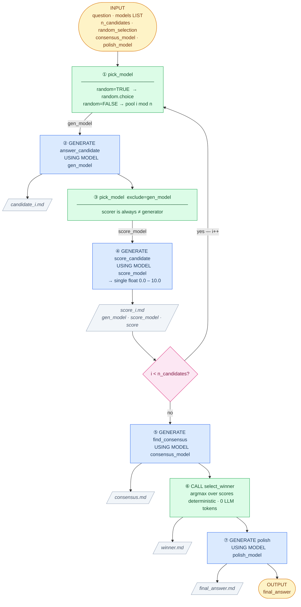
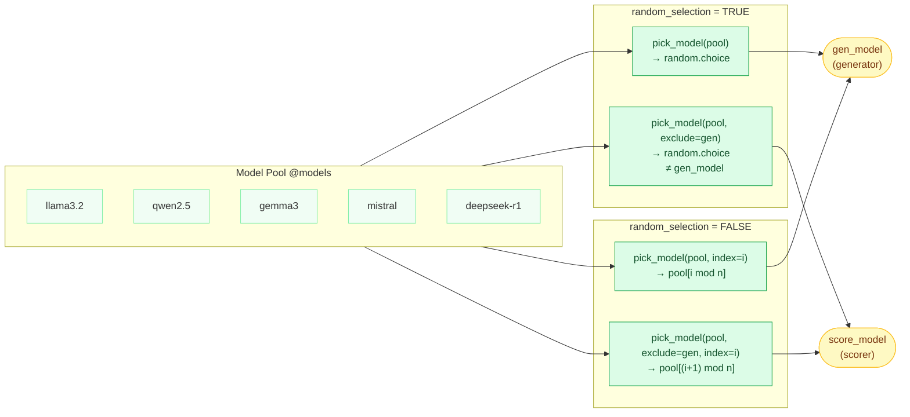
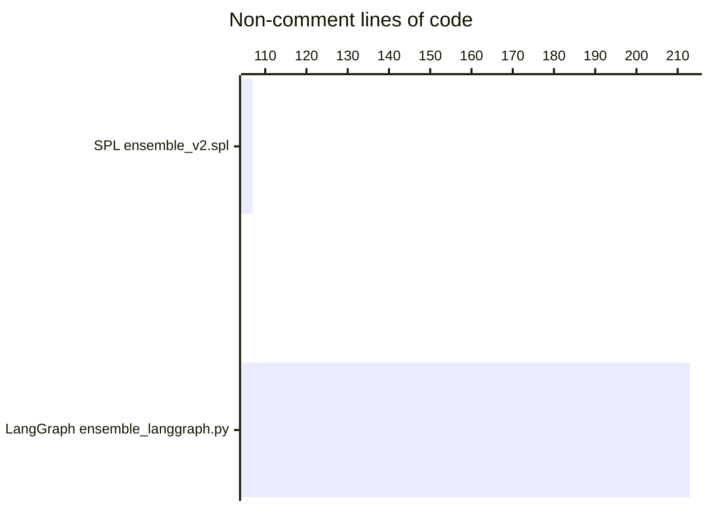

# Ensemble Voting — Workflow & Cross-Framework Comparison

> For the broader argument on why SPL's readability matters across the entire
> development cycle — business analyst, implementer, and governance approver — see
> **[book/ch_spl_vs_langgraph.md](../../book/ch_spl_vs_langgraph.md)**.

## 1. Ensemble Voting Pipeline

The algorithm is the same regardless of framework.
Blue = LLM call · Green = deterministic (0 tokens) · Gray = log file written.



---

## 2. Model Selection Modes

`pick_model()` is called twice per candidate iteration.
The `exclude` parameter on the second call is the key to independent scoring.



---

## 3. SPL vs LangGraph — Same Algorithm, Different Expression

Every row is the same logical operation expressed in each framework.

```mermaid
flowchart LR
    classDef spl  fill:#dbeafe,stroke:#2563eb,color:#1e3a5f
    classDef lg   fill:#fce7f3,stroke:#db2777,color:#831843
    classDef op   fill:#f1f5f9,stroke:#94a3b8,color:#374151

    subgraph OPS["Pipeline operation"]
        direction TB
        OP1["Define prompt"]:::op
        OP2["Manage state"]:::op
        OP3["Call LLM with model"]:::op
        OP4["Loop N times"]:::op
        OP5["Write log file"]:::op
        OP6["Deterministic step"]:::op
        OP7["Wire the pipeline"]:::op
        OP8["CLI entry point"]:::op
    end

    subgraph SPL["SPL  ensemble_v2.spl"]
        direction TB
        S1["CREATE FUNCTION f AS\n$$ prompt text $$"]:::spl
        S2["@variable := value\n(implicit, no declaration)"]:::spl
        S3["GENERATE f() USING MODEL @m"]:::spl
        S4["WHILE @i < @n DO\n  ...\n  @i := @i + 1\nEND"]:::spl
        S5["CALL write_file(path, text)"]:::spl
        S6["CALL python_tool(args)"]:::spl
        S7["sequential code = the graph"]:::spl
        S8["INPUT: @param TYPE DEFAULT v"]:::spl
    end

    subgraph LG["LangGraph  ensemble_langgraph.py"]
        direction TB
        L1["PROMPT = \"\"\"\npromptext\n\"\"\""]:::lg
        L2["class State(TypedDict):\n  field: list[str]  # 14 fields"]:::lg
        L3["ChatOllama(model=m)\n  .invoke(prompt).content"]:::lg
        L4["conditional edge +\nrouting function +\nloop-back edge"]:::lg
        L5["Path(p).write_text(content)"]:::lg
        L6["pure Python function\ncalled inside node"]:::lg
        L7["add_node · add_edge\nset_entry_point · compile()"]:::lg
        L8["argparse.ArgumentParser\n+ 10 add_argument() calls"]:::lg
    end

    OP1 --- S1 & L1
    OP2 --- S2 & L2
    OP3 --- S3 & L3
    OP4 --- S4 & L4
    OP5 --- S5 & L5
    OP6 --- S6 & L6
    OP7 --- S7 & L7
    OP8 --- S8 & L8
```

---

## 4. Line Count

Excluding comments and blank lines:



SPL expresses the same pipeline in **107 lines** vs **213 lines** for LangGraph —
roughly **half the code**, with higher readability for non-engineers.

The gap comes entirely from ceremony LangGraph requires that SPL eliminates:
state declaration, graph wiring, loop routing, model plumbing, and CLI boilerplate.
